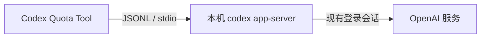

# Codex Quota Tool

一个支持 macOS 与 Windows 的 Codex 桌面悬浮小组件，用于展示当前账户的额度窗口、重置时间、积分余额和可用重置券。

> [!IMPORTANT]
> 这是非官方社区项目，与 OpenAI 无隶属、合作或背书关系。它依赖实验性的 `codex app-server` 接口，该接口及返回结构可能随 Codex 更新而变化。

## 功能

- macOS 菜单栏显示剩余百分比，Windows 系统托盘提供显示、刷新和退出入口
- 可拖动、始终置顶的紧凑悬浮卡片
- 展示 5 小时、每周及服务端返回的其他额度窗口
- 展示积分余额、个人月度额度及可用重置券
- 每 5 分钟自动刷新，支持手动刷新和重新连接
- macOS 与 Windows 均支持开机启动和关闭窗口后驻留托盘
- 不读取、不复制、不保存 Codex 登录令牌

跨平台桌面端位于 [`apps/desktop-tauri`](apps/desktop-tauri)，采用 Tauri 2、Rust 和 React。原有 SwiftUI 版仍保留在仓库根目录，供原生 macOS 维护和迁移对照。

## 工作方式与隐私



小组件启动 Codex 自带的本地进程：

```bash
codex app-server --stdio
```

完成 JSONL 初始化握手后，它调用只读方法：

```json
{"method":"account/rateLimits/read","id":10}
```

当收到 `account/rateLimits/updated` 通知时，小组件会重新读取完整快照。剩余百分比按 `100 - usedPercent` 计算；窗口名称依据 `windowDurationMins` 判断，不假定 `primary` 永远代表固定窗口。

额度快照只保存在应用内存中。项目不包含独立的分析、遥测或第三方上报代码，也不自行保存账户令牌；由 `codex app-server` 使用你已经存在的 Codex 登录会话与 OpenAI 服务通信。

协议依据可参考 OpenAI Codex 仓库中的 [App Server 文档](https://github.com/openai/codex/blob/main/codex-rs/app-server/README.md)。

## 系统要求

- macOS 13 或更高版本，或 Windows 10/11
- 本机存在可运行的 `codex`：macOS 可来自 Codex/ChatGPT 桌面应用或 PATH；Windows 需将 Codex CLI 加入 PATH
- 已在 Codex 中登录 ChatGPT 账户
- Node.js 20+ 与 Rust stable（仅从源码构建时需要）

可通过环境变量 `CODEX_BINARY` 指定 Codex 可执行文件。Windows 用户如只在 WSL 内安装了 Codex，可设置 `CODEX_USE_WSL=1` 启用显式 WSL 兜底；默认不会自动跨入 WSL。

## 使用构建好的应用

### macOS

1. 解压 macOS 发布包。
2. 将 `Codex Quota Tool.app` 拖入 Finder 侧边栏的“应用程序”。
3. 在“应用程序”中右键该应用，选择“打开”，再在系统提示中选择“打开”。
4. 启动后可从屏幕右上角的菜单栏额度图标显示或隐藏窗口。

建议先移动到“应用程序”文件夹，再启用“开机启动”，避免应用路径变化导致登录项失效。

### Windows

1. 下载发布页中的 `.msi` 或 NSIS `.exe` 安装包。
2. 完成安装后，从开始菜单打开 **Codex Quota Tool**。
3. 窗口关闭后应用仍驻留系统托盘；右键托盘图标可刷新或退出。

公开分发的 macOS 构建应完成 Developer ID 签名和公证，Windows 构建应进行代码签名。详情见 [发布说明](docs/RELEASING.md)。

## 构建跨平台桌面端

```bash
git clone https://github.com/changzhengithub/codex-quota-tool.git
cd codex-quota-tool
cd apps/desktop-tauri
npm ci
npm run tauri build
```

构建产物位于 `apps/desktop-tauri/src-tauri/target/release/bundle/`。Tauri 需要在目标操作系统上构建：在 macOS 生成 `.app`/`.dmg`，在 Windows 生成 `.msi`/`.exe`。

macOS/Linux shell 也可以在仓库根目录运行：

```bash
./Scripts/build-desktop.sh
```

调试模式：

```bash
cd apps/desktop-tauri
npm run tauri dev
```

原生 SwiftUI 版仍可通过 `./Scripts/build-app.sh` 构建，或用 Xcode 打开 `Package.swift`。

## 测试

运行跨平台端测试：

```bash
cd apps/desktop-tauri
npm run build
cargo test --manifest-path src-tauri/Cargo.toml
```

运行原生 Swift 版测试：

```bash
swift test
```

真实账户集成测试默认不会运行。只有在你明确选择后，才会使用当前登录态执行一次只读额度查询：

```bash
LIVE_CODEX_TEST=1 swift test --filter CodexAppServerIntegrationTests
```

## 故障排查

- **打开后无反应**：先查看 macOS 菜单栏或 Windows 系统托盘；也可在活动监视器/任务管理器中搜索应用。
- **显示“找不到 Codex”**：macOS 请确认桌面应用已安装；Windows 请在终端运行 `codex --version`，确认 CLI 在 PATH 中。
- **显示未登录或查询超时**：先打开 Codex 完成登录，再从菜单栏选择“重连”。
- **需要自定义 Codex 路径**：从终端启动时设置 `CODEX_BINARY=/path/to/codex`。
- **macOS 开机启动失败**：确认应用已经移动到 `/Applications`，再重新关闭并启用该选项。
- **Windows 缺少 WebView**：安装或修复 Microsoft Edge WebView2 Runtime 后重试。
- **朋友的 Mac 提示无法验证开发者**：公开分发应使用 Developer ID 签名和 Apple 公证，参见 [发布说明](docs/RELEASING.md)。

## 参与项目

提交代码前请阅读 [贡献指南](CONTRIBUTING.md) 与 [行为准则](CODE_OF_CONDUCT.md)。安全问题请按照 [安全策略](SECURITY.md) 私下报告，不要公开提交包含账户信息的 Issue。

仓库所有者第一次公开前还需要完成 [开源发布清单](docs/OPEN_SOURCE_CHECKLIST.md)，其中包括配置仓库安全选项和选择二进制签名方式。

## 许可证

项目以 [MIT License](LICENSE) 开源。名称及相关商标归各自权利人所有。
