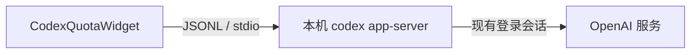

# CodexQuotaWidget

一个原生 macOS 菜单栏与桌面悬浮小组件，用于展示当前 Codex 账户的额度窗口、重置时间、积分余额和可用重置券。

> [!IMPORTANT]
> 这是非官方社区项目，与 OpenAI 无隶属、合作或背书关系。它依赖实验性的 `codex app-server` 接口，该接口及返回结构可能随 Codex 更新而变化。

## 功能

- 菜单栏持续显示当前最紧张额度窗口的剩余百分比
- 可拖动、始终置顶并跨桌面显示的悬浮卡片
- 展示 5 小时、每周及服务端返回的其他额度窗口
- 展示积分余额、个人月度额度及可用重置券
- 每 5 分钟自动刷新，支持手动刷新和重新连接
- 支持开机启动
- 不读取、不复制、不保存 Codex 登录令牌

## 工作方式与隐私



小组件启动 Codex 自带的本地进程：

```bash
codex app-server --stdio
```

完成 JSONL 初始化握手后，它调用只读方法：

```json
{"method":"account/rateLimits/read","id":10}
```

当收到 `account/rateLimits/updated` 通知时，小组件会重新读取完整快照。剩余百分比按 `100 - usedPercent` 计算；窗口名称依据 `windowDurationMins` 判断，不假定 `primary` 永远代表固定窗口。

额度快照只保存在应用内存中。项目不包含独立的分析、遥测或第三方上报代码，也不自行保存账户令牌；由 `codex app-server` 使用你已经存在的 Codex 登录会话与 OpenAI 服务通信。

协议依据可参考 OpenAI Codex 仓库中的 [App Server 文档](https://github.com/openai/codex/blob/main/codex-rs/app-server/README.md)。

## 系统要求

- macOS 14 或更高版本
- 已安装 Codex 或 ChatGPT 桌面应用
- 已在 Codex 中登录 ChatGPT 账户
- 当前打包脚本默认构建 Apple Silicon（arm64）版本

## 使用构建好的应用

1. 解压 `CodexQuotaWidget.zip`。
2. 将 `CodexQuotaWidget.app` 拖入 Finder 侧边栏的“应用程序”。
3. 在“应用程序”中右键该应用，选择“打开”，再在系统提示中选择“打开”。
4. 应用没有 Dock 图标；启动成功后请查看屏幕右上角的菜单栏额度图标。

建议先移动到“应用程序”文件夹，再启用“开机启动”，避免应用路径变化导致登录项失效。

本地脚本生成的是 ad-hoc 签名构建。它适合自己的 Mac 测试，但不等同于经过 Apple Developer ID 签名和公证的公开发行版。给其他人分发前请阅读 [发布说明](docs/RELEASING.md)。

## 从源码构建

```bash
git clone https://github.com/changzhengithub/codex-quota-tool.git
cd codex-quota-tool
./Scripts/build-app.sh
open dist/CodexQuotaWidget.app
```

也可以直接用 Xcode 打开 `Package.swift`，然后运行 `CodexQuotaWidget` scheme。

## 测试

运行默认单元测试：

```bash
swift test
```

真实账户集成测试默认不会运行。只有在你明确选择后，才会使用当前登录态执行一次只读额度查询：

```bash
LIVE_CODEX_TEST=1 swift test --filter CodexAppServerIntegrationTests
```

## 故障排查

- **打开后无反应**：应用没有 Dock 图标，请先查看菜单栏；也可打开“活动监视器”搜索 `CodexQuotaWidget`。
- **显示“找不到 Codex”**：确认 `/Applications/ChatGPT.app` 或 `/Applications/Codex.app` 已安装。
- **显示未登录或查询超时**：先打开 Codex 完成登录，再从菜单栏选择“重连”。
- **需要自定义 Codex 路径**：从终端启动时设置 `CODEX_BINARY=/path/to/codex`。
- **开机启动失败**：确认应用已经移动到 `/Applications`，再重新关闭并启用该选项。
- **朋友的 Mac 提示无法验证开发者**：公开分发应使用 Developer ID 签名和 Apple 公证，参见 [发布说明](docs/RELEASING.md)。

## 参与项目

提交代码前请阅读 [贡献指南](CONTRIBUTING.md) 与 [行为准则](CODE_OF_CONDUCT.md)。安全问题请按照 [安全策略](SECURITY.md) 私下报告，不要公开提交包含账户信息的 Issue。

仓库所有者第一次公开前还需要完成 [开源发布清单](docs/OPEN_SOURCE_CHECKLIST.md)，其中包括配置仓库安全选项和选择二进制签名方式。

## 许可证

项目以 [MIT License](LICENSE) 开源。名称及相关商标归各自权利人所有。
